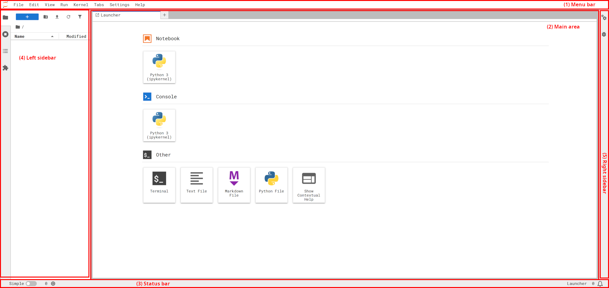

# 🔭 Exploring extensions

:::{hint} Learning objectives
* Understand the canonical names for components of the JupyterLab interface
* Understand frontend vs server extensions
* Explore various types of extensions
:::

:::{tip} Terms
{term}`menu bar`, {term}`main area`, {term}`status bar`, {term}`side panel`
:::

## [The JupyterLab interface](https://jupyterlab.readthedocs.io/en/latest/user/interface.html)

1. {term}`Menu bar`
2. {term}`Main area`
3. {term}`Status bar`
4. Left {term}`side panel`
5. Right {term}`side panel`

## Extension types

🏗️ TODO!

## Example extensions

🏗️ TODO!

* List extensions
* Link to their docs / home page
* Brief summary, what makes it unique architecturally, e.g. is it frontend only, does it
  have server component, does it expose new commands.
