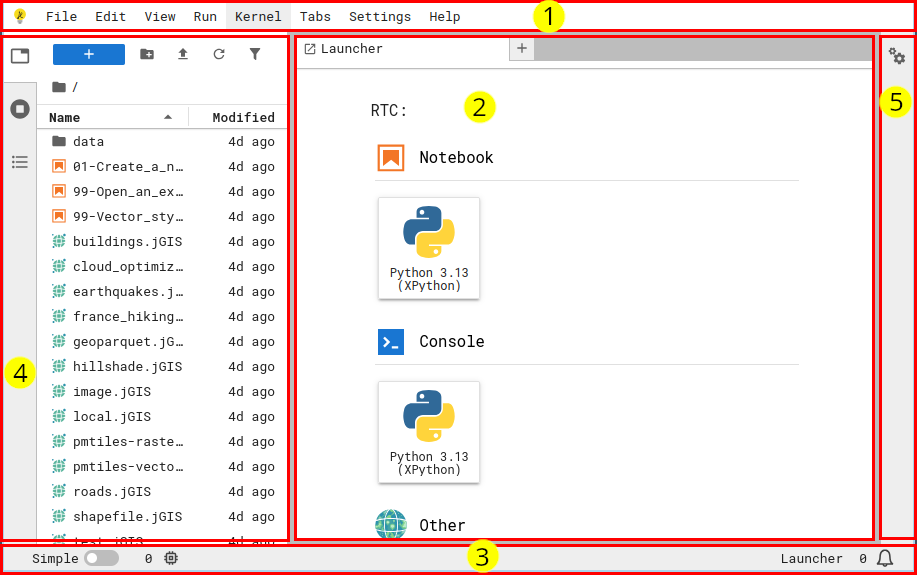

# 🔭 1 - Exploring extensions

:::{hint} Learning objectives
* Understand the canonical names for components of the JupyterLab interface
* Understand frontend vs server extensions
* Explore various types of extensions
:::

:::{tip} Terms
{term}`extension <extension>`, {term}`plugin <plugin>`, {term}`widget <widget>`,
{term}`menu bar <menu bar>`, {term}`main area <main area>`,
{term}`status bar <status bar>`, {term}`side panel <side panel>`
:::


## What is JupyterLab?

It's not just an interface for working with Notebooks.
The Jupyter Notebook interface has been around since _blank_, and in the mid-2010s,
JupyterLab was introduced to provide a more comprehensive environment, like an operating
system, for interactive computation.


## [The JupyterLab interface](https://jupyterlab.readthedocs.io/en/latest/user/interface.html)

[](../assets/images/jupyterlab-interface.png)

1. {term}`Menu bar`
2. {term}`Main area`
3. {term}`Status bar`
4. Left {term}`side panel <side panel>`
5. Right {term}`side panel <side panel>`


## Extensions and plugins and widgets -- oh, my!

While they sound similar, {term}`extensions <extension>` and {term}`plugins <plugin>`
serve different purposes.

{term}`Plugins <plugin>` are JupyterLab's fundamental building blocks which define
functionality and business logic.
{term}`Extensions <extension>` are the delivery mechanism or "container" for plugins.
Extensions are the thing that end-users `pip install`.

:::{pull-quote}
End-users care about extensions, and developers care about plugins.
:::

A {term}`widget <widget>` is a user interface component provided by a plugin, either for
the end user to display (e.g. an interactive visualization of data) or for JupyterLab to
display (e.g. a document viewer that opens when you double-click a particular file
type).

```{mermaid}
graph TB

    subgraph Extension["Extension"]
        subgraph Plugin["Plugin(s) (n>=1)"]
            Widget["Widget(s) (n>=0)"]
        end
    end

    style Widget stroke-dasharray: 5 5
```


## Extension types

### {term}`Server extension`

Extensions that run on the JupyterLab server, which means it has access to the same
hardware as JupyterLab and can, for example, load data from disk and perform
computations.

Examples:

* [jupyter-server-proxy](https://github.com/jupyterhub/jupyter-server-proxy) enables
  running, supervising, and proxying additional web services within a JupyterLab
  deployment.
* [nbgitpuller](https://github.com/jupyterhub/nbgitpuller) enables automated fetching of
  content in a Git repository into JupyterLab from a special URL.
  Especially useful for teachers to provide their students with access to educational
  materials in a JupyterHub by clicking a single link.


### {term}`Frontend extension`

Extensions that run in the JupyterLab frontend (i.e. the user's browser), which means it
can change anything about the appearance of JupyterLab and provide new
{term}`widgets <widget>` for display and/or interactions.

Examples:

* [jupyterthemes](https://github.com/dunovank/jupyter-themes) provides custom
  appearances for Notebooks.
* ...


### Frontend **and** server

A very common pattern is extensions which combine frontend and server extensions to
provide new interface features which trigger behavior on the server.

Examples:

* [jupyterlab-git](https://github.com/jupyterlab/jupyterlab-git)
  provides visual git management.
* [jupyter-resource-usage](https://github.com/jupyter-server/jupyter-resource-usage)
  displays information about kernel resource (CPU, RAM) usage in the frontend.
* [gator](https://github.com/mamba-org/gator) enables graphical management of
  conda/mamba environments.
* [JupyterGIS](https://jupytergis.readthedocs.io/en/latest/) (beta) provides a
  Geospatial Information System (GIS) interface for working with geospatial data.
* ..


### {term}`MIME renderer extension` (a.k.a. "mimetype" extension)

Extensions that tell Jupyter how to view information in a specific file type
([MIME type](https://developer.mozilla.org/en-US/docs/Web/HTTP/Guides/MIME_types)).

These are a subset of {term}`frontend extensions <frontend extension>` which map a
{term}`widget` viewer with the supported file MIME type strings.

Examples:

* [jupyterlab-geojson](https://pypi.org/project/jupyterlab-geojson/) enables
  double-clicking on GeoJSON files and viewing them on a JupyterLab-native map viewer.
* ...


## More...

🏗️ TODO! What go here?
