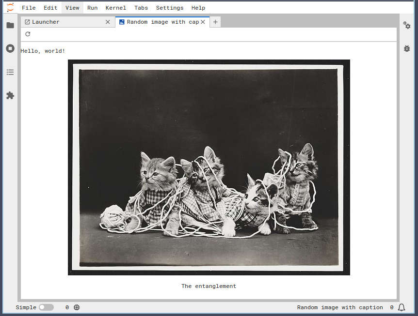

# 🧬 2 - Anatomy of an extension

:::{important} Outcomes
In this module, we will:

* Create a new extension starting from the
[official template](https://github.com/jupyterlab/extension-template).
* Implement a new widget for displaying a random image and caption from a curated set.
* Implement launching this widget from the {term}`command palette <command palette>`
  and the {term}`launcher <launcher>`.
* Implement a user interaction which enables users to request a new random item in
  real time.
:::

:::{tip} Terms
{term}`main area widget <main area widget>`, {term}`command <command>`,
{term}`command palette <command palette>`, {term}`launcher <launcher>`
:::

:::{note} Inspired by...
:class: dropdown

This tutorial is inspired by many prior works.

* SciPy 2018 tutorial:
  [repo](https://github.com/jupyterlab/scipy2018-jupyterLab-tutorial)
  | [video](https://youtu.be/Gzun8PpyBCo?si=M6NWrbQvMpJX1Yjg&t=5390)
* JupyterCon 2018 tutorial:
  [repo](https://github.com/jupyterlab/jupytercon-jupyterlab-tutorial)
* SciPy 2019 tutorial:
  [repo](https://github.com/jupyterlab/scipy2019-jupyterlab-tutorial)
  | [video](https://www.youtube.com/watch?v=RFabWieskak)
* JupyterCon 2020 tutorial:
  [repo](https://github.com/jupytercon/jupytercon2020-developingextensions)
* SciPy 2022 tutorial:
  [repo](https://github.com/marthacryan/developing-extensions-tutorial)
  | [video](https://www.youtube.com/watch?v=9_-siU-_XoI)
* The official
  [Astronomy picture of the day](https://jupyterlab.readthedocs.io/en/latest/extension/extension_tutorial.html)
  tutorial with a few changes (some of which we plan to merge back):
    * Include a server extension
    * Add an interactive element (toolbar button) to refresh the image
    * Use a set of public domain images from the Library of Congress (the NASA astronomy
      photo API is not reliable during the current government shutdown 😭)
    * Structure the activities around in person teaching and exercises
:::


## 🛠️ Setup

Before we get started, we need to set up:

* Development dependencies on our local machine
* Git configuration on our local machine
* A repository on GitHub


### 🔧 Dependency environment

Create an environment named `jupytercon2025`.
We'll use this environment for the rest of this workshop:

```bash
# Create an environment named "jupytercon2025"
micromamba create --name jupytercon2025

# Activate it
# IMPORTANT: Run this every time you open a new terminal!
micromamba activate jupytercon2025

# Install workshop dependencies
## python & pip: Python language and its official package installer
## nodejs: A JavaScript runtime
## gh: The GitHub CLI
## copier: A tool for quickstarting an extension from a template
## jinja2-time: A dependency of the official JupyterLab extension template
micromamba install python pip nodejs=22 gh "copier~=9.2" jinja2-time
```


### 🔧 Important Git settings

1. Git needs to know who you are.

   Configure identity information Git will use when we commit:

   ```bash
   git config --global user.email "your-email-here@example.com"
   git config --global user.name "Your Name Here"
   ```

2. The modern conventional branch name is `main`, and this tutorial will assume
   you're working on the `main` branch.

   Ensure your default branch is set to `main`:

   ```bash
   git config --global init.defaultBranch main
   ```


:::{important} 👀 You should notice...
:class: simple
:icon: false

...these commands produce no output when successful.
:::


(gh-auth-setup)=
### 🔧 Create a GitHub repository and clone it locally

0. Change to the parent directory where you want to work, e.g.

   ```bash
   cd ~/Projects
   ```

1. If you don't already have GitHub authentication set up on your local machine,
   authenticate with GitHub.

   ```bash
   gh auth login
   ```

   Select reasonable defaults: `GitHub.com`, `HTTPS`, `Yes`, and `Login with a web browser`, then follow the
   instructions carefully.

   :::{important} 👀 You should notice...
   :class: simple
   :icon: false

   ...after answering the questions, you'll be prompted to copy a secret token, then
   press `ENTER` to open a special page in your browser, then paste the token there.

   You'll have to confirm some prompts in your browser, then you should see this message
   in your terminal:

   ```
   ✓ Authentication complete
   ```
   :::

2. Set up the Git CLI to authenticate with GitHub:

   ```bash
   gh auth setup-git
   ```

3. Create a repository in GitHub and clone it:

   ```bash
   gh repo create jupytercon2025-extension-workshop --public --clone
   ```

4. Change directory into your newly-cloned repository:

   ```bash
   cd jupytercon2025-extension-workshop
   ```

5. Add some useful metadata to your repository:

   ```bash
   gh repo edit --add-topic "jupytercon2025" --add-topic "jupyterlab-extension"
   ```

6. Get your cloned repository's URL:

   ```bash
   gh repo view
   ```

   :::{important} 👀 You should notice...
   :class: simple
   :icon: false

   ...a full description of your repository is printed to the terminal.
   The final line of output includes a repository URL starting with
   `https://github.com/`.
   :::

   **Copy the entire repository URL** and **leave this terminal window open** for the next step!


## What are we building together?

First, we'll examine and demonstrate
[the extension we're going to build today](https://github.com/jupytercon/jupytercon2025-developingextensions-demo).

Our extension will:

* Add a viewer for a small collection of public domain images and captions
* Enable the user to interactively display a random item from the collection
* Add a new button to the launcher to open the viewer
* Add a new command to the command palette to open the viewer

🚀 Let's build it together from scratch.


## 🏋️ Exercise A (15 minutes): Extension creation and development loop

### 🔧 Create a new extension from the [official template](https://github.com/jupyterlab/extension-template)

1. Instantiate the template to get started on our new extension!

   We've pre-populated the answers to many of the questions the template normally asks
   in the command below.
   If you want to use this template in the future for a different project, omit all the
   `--data` arguments.

   ```bash
   copier copy --trust --vcs-ref v4.5.0 https://github.com/jupyterlab/extension-template . \
     --data kind=frontend-and-server \
     --data labextension_name=jupytercon2025-extension-workshop \
     --data python_name=jupytercon2025_extension_workshop \
     --data project_short_description="A JupyterLab extension that displays a random image and caption." \
     --data has_settings=false \
     --data has_binder=false \
     --data test=true \
     --data has_ai_rules=true \
     --data create_claude_symlink=true \
     --data create_gemini_symlink=true
   ```

    Please be sure to correctly input the repository URL as printed by the `gh repo
    view` command in the previous step.

2. List the files that were created (`ls -la` or `tree -a` are good options).

   :::{important} 👀 You should notice...
   :class: simple
   :icon: false

   ...a long list of files that the extension template created for you,
   including:

   * Project configuration files like `pyproject.toml` and `package.json`
   * Documentation files like `README.md` and `RELEASE.md`
   * Source code directories like `src/` (JavaScript) and
     `jupytercon2025_extension_workshop/` (Python).
   :::

3. Install the extension in development mode

   ```bash
   # Install package in development mode
   pip install --editable ".[dev,test]"
   ```

   :::{important} 👀 You should notice...
   :class: simple
   :icon: false

   ...lots of terminal output!
   The final line should read:

   ```bash
   Successfully installed <a long list of Python packages like MarkupSafe, AnyIO, ...,
   jupytercon2025_extension_workshop, jupyterlab, ..., webencodings, and
   websocket-client>
   ```
   :::

4. Connect the extension, frontend and server, to JupyterLab

   ```bash
   jupyter labextension develop . --overwrite
   jupyter server extension enable jupytercon2025_extension_workshop
   ```

   :::{important} 👀 You should notice...
   :class: simple
   :icon: false

   ...3 lines of terminal output starting with `Installing`, `Removing`, and
   `Symlinking`.
   :::

5. Build the extension

   ```bash
   # Rebuild extension Typescript source after making changes
   # IMPORTANT: We must do this every time we make a change!
   jlpm build
   ```

   :::{important} 👀 You should notice...
   :class: simple
   :icon: false

   ...many lines of colorful terminal output ending with a message similar to:

   ```bash
   webpack 5.102.1 compiled successfully in 26 ms
   ```
   :::


### 🧪 Test

1. Start JupyterLab in a **separate terminal**.

   :::{hint} Reminder
   Activate the virtual environment again with `micromamba activate jupytercon2025` any
   time you create a new terminal.
   :::

   After running this command, we can keep this terminal open and running JupyterLab in
   the background!

   ```bash
   jupyter lab
   ```

   :::{important} 👀 You should notice...
   :class: simple
   :icon: false

   ...JupyterLab automatically opened in your browser when you started the server.
   :::

2. Confirm the extension was loaded. Open your browser's dev console (`F12` or
   `Cmd/Ctrl+Shift+I`, or `Cmd+Option+I` on Mac) and...

   :::{important} 👀 You should notice...
   :class: simple
   :icon: false

   ...log messages reading:

   * `JupyterLab extension jupytercon2025-extension-workshop is activated!`
   * `Hello, world! This is the '/jupytercon2025-extension-workshop/hello' endpoint. Try
     visiting me in your browser!`

   **If you do not see these messages, let instructors know you need help!**
   :::

3. Test the server endpoint by visiting it in your browser
   (`http://localhost:8888/jupytercon2025-extension-workshop/hello`).

   :::{important} 👀 You should notice...
   :class: simple
   :icon: false

   ...the same message as you saw in the console in the last step, but this time in your
   main browser window:
   `Hello, world! This is the '/jupytercon2025-extension-workshop/hello' endpoint. Try
   visiting me in your browser!`
   :::


:::{important} 💾 **Make a Git commit and push to GitHub now!**
:icon: false

```bash
git add .
git commit -m "Initialize from extension template"
git push -u origin main
```
:::


### 🔧 Do a complete development loop

0. Close the JupyterLab server with `Ctrl+C`.

1. Make any change to the codebase.
   For example, alter the text in a `console.log()` message.
   We suggest changing `Hello, world!` in the server's message (in
   `jupytercon2025_extension_workshop/routes.py`) to `Hello,
   <your-name-here>!`.

2. Rebuild the extension with `jlpm build`.


### 🧪 Test

Follow the same testing steps as last time.

:::{important} 👀 You should notice...
:class: simple
:icon: false

The console messages in your browser changed according to the edits you made.

The server endpoint returns a new value according to the edits you made.
:::

**Please repeat this development loop as many times as you can to get more comfortable
with it.**


:::{important} 💾 **Make a Git commit and push to GitHub now!**
:icon: false

```bash
git add .
git commit -m "Test development loop with a simple change"
git push -u origin main
```
:::


### 🧠 What do we know now?

We know how to get started: we learned how to instantiate a new extension from the
official template and set it up for development.

We know how to iterate: we learned that the JupyterLab extension development loop is...

* Make a change to the code.
* Shut down JupyterLab (`Ctrl+C`).
* Rebuild the extension with `jlpm build` [^rebuild-not-always-required].
* Start JupyterLab with `jupyter lab`.

Now we have all the knowledge we need to keep iterating on our extension!
🎓 Well done!


## 😖 "Hello, world" is boring!

Our working extension is a basic "hello, world" application.
All it does is log a string to the console, then make a request to the back-end
for another string, which is also logged to the console.
This all happens **once** when the user opens JupyterLab and the extension is activated.

Our goal is to display a viewer for a random photo and caption, with a refresh button to
instantly display a new image.
That viewer will be a {term}`widget`, so let's start by creating a widget that
will eventually house that content.


## 🏋️ Exercise B (20 minutes): Launching a "hello, world" {term}`widget <widget>`

### 🔧 Create a "hello, world" widget

To display this widget in the {term}`main area <main area>`, we need to
implement a {term}`widget <widget>` which displays our content (for now, just
"Hello, world!"), and then include that content in a
{term}`main area widget <main area widget>`.

Create a new file `src/widget.ts` and add the widget code:

```{code} typescript
:linenos:
:filename: src/widget.ts

import { Widget } from '@lumino/widgets';
import { MainAreaWidget } from '@jupyterlab/apputils';
import {
  imageIcon,
} from '@jupyterlab/ui-components';

class ImageCaptionWidget extends Widget {
  // Initialization
  constructor() {
    super();

    // Create and append an HTML <p> (paragraph) tag to our widget's node in
    // the HTML document
    const hello = document.createElement('p');
    hello.innerHTML = "Hello, world!";
    this.node.appendChild(hello);
  }
}

export class ImageCaptionMainAreaWidget extends MainAreaWidget<ImageCaptionWidget> {
  constructor() {
    const widget = new ImageCaptionWidget();
    super({ content: widget });

    this.title.label = 'Random image with caption';
    this.title.caption = this.title.label;
    this.title.icon = imageIcon;
  }
}
```

Our widget is using JavaScript to define HTML elements that will appear in the widget.
That looks like this:

```{mermaid}
graph TB

    subgraph Widget["Widget (this.node)"]
        subgraph Hello["&lt;p&gt; element (hello)"]
            Content["'Hello, world!' (hello.innerHTML)"]
        end
    end
```

And the HTML looks roughly like this:

```html
<div id="our-widget">
  <p>Hello, world!</p>
</div>
```

We can't test this because we don't have a convenient way to display the
widget in JupyterLab yet.
Let's fix that now.


### 🔧 Create a {term}`command <command>` to display the {term}`widget <widget>` in the {term}`main area <main area>`

In `src/index.ts`, we need to update our plugin to define a command in our
{term}`plugin's <plugin>` `activate` method:

```{code} typescript
:linenos:
:emphasize-lines: 2,26-37
:filename: src/index.ts

import { requestAPI } from './request';
import { ImageCaptionMainAreaWidget } from './widget';

/**
 * Initialization data for the jupytercon2025-extension-workshop extension.
 */
const plugin: JupyterFrontEndPlugin<void> = {
  id: 'jupytercon2025-extension-workshop:plugin',
  description: 'A JupyterLab extension that displays a random image and caption.',
  autoStart: true,
  activate: (
    app: JupyterFrontEnd,
  ) => {
    console.log('JupyterLab extension jupytercon2025-extension-workshop is activated!');

    requestAPI<any>('hello')
      .then(data => {
        console.log(data);
      })
      .catch(reason => {
        console.error(
          `The jupytercon2025_extension_workshop server extension appears to be missing.\n${reason}`
        );
      });

    //Register a new command:
    const command_id = 'image-caption:open';
    app.commands.addCommand(command_id, {
      execute: () => {
        // When the command is executed, create a new instance of our widget
        const widget = new ImageCaptionMainAreaWidget();

        // Then add it to the main area:
        app.shell.add(widget, 'main');
        return widget;
      },
      label: 'View a random image & caption'
    });
  }
};
```

But right now, this command is not being used by anything!
Next, we'll add it to the {term}`command palette <command palette>`.


### 🔧 Register our {term}`command <command>` with the {term}`command palette <command palette>`

First, import the command palette interface at the top of `src/index.ts`:

```{code} typescript
:linenos:
:emphasize-lines: 5
:filename: src/index.ts

import {
  JupyterFrontEnd,
  JupyterFrontEndPlugin
} from '@jupyterlab/application';
import { ICommandPalette } from '@jupyterlab/apputils';
```

Then, add the command palette as a dependency of our plugin:

```{code} typescript
:linenos:
:emphasize-lines: 5,8-10
:filename: src/index.ts

const plugin: JupyterFrontEndPlugin<void> = {
  id: 'myextension:plugin',
  description: 'A JupyterLab extension.',
  autoStart: true,
  requires: [ICommandPalette],  // dependencies of our extension
  activate: (
      app: JupyterFrontEnd,
      // The activation method receives dependencies in the order they are specified in
      // the "requires" parameter above:
      palette: ICommandPalette
  ) => {
```

Finally, we can use our `palette` object to register our {term}`command <command>` with
the {term}`command palette <command palette>`.

```{code} typescript
:linenos:
:emphasize-lines: 15
:filename: src/index.ts

    //Register a new command:
    const command_id = 'image-caption:open';
    app.commands.addCommand(command_id, {
      execute: () => {
        // When the command is executed, create a new instance of our widget
        const widget = new ImageCaptionMainAreaWidget();

        // Then add it to the main area:
        app.shell.add(widget, 'main');
      },
      label: 'View a random image & caption'
    });

    palette.addItem({ command: command_id, category: 'Tutorial' });
```


### 🧪 Test

Stop your JupyterLab server (`Ctrl+C`), then rebuild your extension (`jlpm
build`), then restart JupyterLab (`jupyter lab`).

If everything went well, now you can test the extension in your browser.

To test from the {term}`command palette <command palette>`, click
"View">"Commands" from the {term}`menu bar <menu bar>`, or use the shortcut
`Cmd/Ctrl+Shift+C`.
Begin typing "Random image" and the command palette interface
should autocomplete.
Select "Random image with caption" and press `ENTER`.

:::{important} 👀 You should notice...
:class: simple
:icon: false

...a new tab open in the JupyterLab interface containing the text "Hello, world"!
:::


:::{important} 💾 **Make a Git commit and push to GitHub now!**
:icon: false

```bash
git add .
git commit -m "Add 'hello, world' widget and register with command palette"
git push -u origin main
```
:::


### 🔧 Optional: Register with the {term}`launcher <launcher>`

Unlike the command palette, this functionality needs to be installed as a dependency.
First, install `@jupyterlab/launcher` with `jlpm add @jupyterlab/launcher` to make
this dependency available for import.

We can import `ILauncher` with:

```{code} typescript
:filename: src/index.ts

import { ILauncher } from '@jupyterlab/launcher'
```

Don't forget to add the launcher as a dependency (`requires`) of our plugin, and to pass
the dependency in to the `activate` function.

...and register our {term}`command` with the {term}`launcher`:

```{code} typescript
:filename: src/index.ts

launcher.add({ command: command_id });
```

The rest of the implementation up to you!

:::{hint}
Follow the same steps you followed to register our command with the {term}`command palette <command palette>`.
Reuse the same command!
:::

#### 🧪 Test

Repeat the build and test procedure from the previous step.

Open a new tab with the `+` button at the top of the {term}`main area <main area>` and
click the new button in the launcher.

:::{important} 💾 **Make a Git commit and push to GitHub now!**
:icon: false

```bash
git add .
git commit -m "Register widget with launcher"
git push -u origin main
```
:::


#### Troubleshooting: My launcher button works, but it has no icon!

Adding an icon is one extra step.
We can import the icon in `src/index.ts` like so:

```{code} typescript
:filename: src/index.ts

import { imageIcon } from '@jupyterlab/ui-components';
```

and add the icon to the command's metadata:

```{code} typescript
:linenos:
:emphasize-lines: 7
:filename: src/index.ts

    app.commands.addCommand(command, {
      execute: () => {
        const widget = new ImageCaptionMainAreaWidget();

        app.shell.add(widget, 'main');
      },
      icon: imageIcon,
      label: 'View a random image & caption'
    });
```

Give it another test, and you should see an icon.

:::{important} 💾 **Make a Git commit and push to GitHub now!**
:icon: false

```bash
git add .
git commit -m "Define icon for widget open command"
git push -u origin main
```
:::


### 🧠 What do we know now?

We know that a {term}`widget <widget>` by itself isn't very useful, and we need some way to display it.

We decided we want to display our widget in the {term}`main area <main area>`, and we
know that we need a {term}`command <command>` to achieve that.

Finally, we know that we can register our command with the
{term}`command palette <command palette>` and/or the {term}`launcher <launcher>`
to give the user an easy way to execute the command to open the widget.


## 😖 It's still just "hello, world"!

We've graduated from "Hello, world" in the console to "Hello, world" in a
{term}`main area widget <main area widget>`.
That's a big step, but remember our end goal: A viewer for random images and
captions.

We have all the building blocks now: a server to serve the image data from disk
with a caption, and a widget to display them.
Now we need to implement the logic and glue the pieces together.


## 🏋️ Exercise C (20 minutes): Serve images and captions from the server extension

### 🔧 Define images and captions

Create a new directory at `jupytercon2025_extension_workshop/images`:

```bash
mkdir jupytercon2025_extension_workshop/images
```

Then, place images in this directory.
You can choose your own images (favorite cat pictures?) or download images from
[our demo repository](https://github.com/jupytercon/jupytercon2025-developingextensions-demo/tree/main/jupytercon2025_extension_workshop/images).

:::{important} 💾 **Make a Git commit and push to GitHub now!**
:icon: false

```bash
git add .
git commit -m "Add images"
git push -u origin main
```
:::

Now we need a way to associate captions with each image.
We'll use a list of Python dictionaries (mappings) to do so.
Create a new file `jupytercon2025_extension_workshop/images_and_captions.py` and populate it with:

```{code} python
:filename: jupytercon2025_extension_workshop/images_and_captions.py

# Public domain images from https://www.loc.gov/free-to-use/cats/
IMAGES_AND_CAPTIONS = [
    { "filename": "brunnhilde.jpg", "caption": "Brünnhilde" },
    { "filename": "cats.jpg", "caption": "Cats" },
    { "filename": "cat-cher-evolution.jpg", "caption": "Evolution of a cat-cher" },
    { "filename": "the-entanglement.jpg", "caption": "The entanglement" },
]
```


### 🔧 Update the server to serve images and captions

Our server behaviors are defined in
`jupytercon2025_extension_workshop/routes.py`, so that module will need to know
about how to access our image data and the associated captions.
We'll import the data structure we just defined and define a new `Path` object
that references the images directory we just created.
We'll need the `random` standard library module in the next step, so we'll
import that too while we're here:

```{code} python
:linenos:
:emphasize-lines: 1,3-4, 10-12
:filename: jupytercon2025_extension_workshop/routes.py

import base64
import json
import random
from pathlib import Path

from jupyter_server.base.handlers import APIHandler
from jupyter_server.utils import url_path_join
import tornado

from .images_and_captions import IMAGES_AND_CAPTIONS

IMAGES_DIR = Path(__file__).parent.absolute() / "images"


class HelloRouteHandler(APIHandler):
    ...
```

Next, we'll set up a new route handler in our server extension.
This route handler will select a random entry from the `IMAGES_AND_CAPTIONS`
constant we imported, open that image, encode its data as a string,
and then return the string-encoded image data alongside the caption.

```{code} python
:linenos:
:emphasize-lines: 5-17
:filename: jupytercon2025_extension_workshop/routes.py

class HelloRouteHandler(APIHandler):
    ...


class ImageAndCaptionRouteHandler(APIHandler):
    @tornado.web.authenticated
    def get(self):
        random_selection = random.choice(IMAGES_AND_CAPTIONS)

        # Read the data and encode the bytes in base64
        with open(IMAGES_DIR / random_selection["filename"], "rb") as f:
            b64_bytes = base64.b64encode(f.read()).decode("utf-8")

        self.finish(json.dumps({
            "b64_bytes": b64_bytes,
            "caption": random_selection["caption"],
        }))
```

Finally, we need to connect our new handler to the appropriate route:

```{code} python
:linenos:
:emphasize-lines: 6, 9
:filename: jupytercon2025_extension_workshop/routes.py

def setup_route_handlers(web_app):
    host_pattern = ".*$"
    base_url = web_app.settings["base_url"]

    hello_route_pattern = url_path_join(base_url, "jupytercon2025-extension-workshop", "hello")
    image_route_pattern = url_path_join(base_url, "jupytercon2025-extension-workshop", "random-image-caption")
    handlers = [
        (hello_route_pattern, HelloRouteHandler),
        (image_route_pattern, ImageAndCaptionRouteHandler),
    ]

    web_app.add_handlers(host_pattern, handlers)
```


### 🧪 Test

Now's the best time for us to stop and test before moving on to consuming this
data with our widget.
Does our server endpoint return the data we expect it to?
If there's something wrong and we jump straight to working on the UI, we could
have a bad time.

Since we only altered Python code, we don't need to run `jlpm build`.
We can see our changes by restarting JupyterLab and visiting
`http://localhost:8888/jupytercon2025-extension-workshop/random-image-caption`.

Refresh the page several times, and you should see the data change with each
refresh (except when the same image is randomly selected multiple times in a
row!).

:::{hint}
Not working right?

Look in the terminal that's running the `jupyter lab` command.
Any errors being triggered from the Python code will show up there.

Perhaps you missed an import in a previous step!
:::

:::{important} 💾 **Make a Git commit and push to GitHub now!**
:icon: false

```bash
git add .
git commit -m "Add random image and caption endpoint"
git push -u origin main
```
:::


### 🔧 Connect the {term}`widget` to the {term}`server extension`

Now that our backend is working, we need to glue our widget to it.

First, let's import a utility function to `src/widget.ts` that will handle
requesting an image and caption from the server:

```{code} typescript
:linenos:
:emphasize-lines: 7
:filename: src/widget.ts

import { Widget } from '@lumino/widgets';
import { MainAreaWidget } from '@jupyterlab/apputils';
import {
  imageIcon,
} from '@jupyterlab/ui-components';

import { requestAPI } from './request';
```

Now, let's add the behavior to our widget which uses `requestAPI` to
communicate with the server.
This change adds a new method `load_image()` to our widget class, but notice
that nothing is calling that method yet:

```{code} typescript
:linenos:
:emphasize-lines: 7-19, 21-23
:filename: src/widget.ts

class ImageCaptionWidget extends Widget {
  // Initialization
  constructor() {
    // ...
  }

  // Fetch data from the server extension and save the results to img and
  // caption class attributes
  load_image(): void {
    requestAPI<any>('random-image-caption')
      .then(data => {
        console.log(data);
        this.img.src = `data:image/jpeg;base64, ${data.b64_bytes}`;
        this.caption.innerHTML = data.caption;
      })
      .catch(reason => {
        console.error(`Error fetching image data.\n${reason}`);
      });
  }

  // Information about class attributes for the type checker
  img: HTMLImageElement;
  caption: HTMLParagraphElement;
}
```

Finally, let's hook this behavior up to display it visually.
Now, we're calling `load_image()` when we initialize the widget:

```{code} typescript
:linenos:
:emphasize-lines: 12-25
:filename: src/widget.ts

class ImageCaptionWidget extends Widget {
  // Initialization
  constructor() {
    super();

    // Create and append an HTML <p> (paragraph) tag to our widget's node in
    // the HTML document
    const hello = document.createElement('p');
    hello.innerHTML = "Hello, world!";
    this.node.appendChild(hello);

    const center = document.createElement('center');
    this.node.appendChild(center);

    // Put an  tag into the <center> tag, and also save it as a class
    // attribute so we can update it later.
    this.img = document.createElement('img');
    center.appendChild(this.img);

    // Do the same for a caption!
    this.caption = document.createElement('p');
    center.appendChild(this.caption);

    // Initialize the image from the server extension
    this.load_image();
  }

  // Fetch data from the server extension and save the results to img and
  // caption class attributes
  load_image(): void {
    // ...
  }

  // Information for the type checker
  img: HTMLImageElement;
  caption: HTMLParagraphElement;
}
```

### 🧪 Test

Now that we have our widget user interface hooked up to the data coming from the server, let's test again.
Because we changed the JavaScript, we need to use `jlpm run build`, but we _don't_ need to restart the JupyterLab server.
We just need to refresh the page!

:::{important} 👀 You should notice...
:class: simple
:icon: false

...when you launch the widget from the {term}`command palette <command palette>` or
{term}`launcher <launcher>`, one of the images we uploaded at the beginning of this
exercise is shown, alongside the associated caption.
:::


:::{hint}
Running into trouble?

Check your browser console for errors.

If you're using your own images, perhaps they aren't JPEG images like the demo images we provided.
You may need to update the preamble of `this.img.src` from
`data:image/jpeg;base64` to `data:image/png;base64`, for example.
If you have mixed data formats, perhaps you could add the mimetype of each
image to the JSON data sent by the server!
:::


:::{important} 💾 **Make a Git commit and push to GitHub now!**
:icon: false

```bash
git add .
git commit -m "Add random image and caption endpoint"
git push -u origin main
```
:::


### 🧠 What do we know now?

We know that a {term}`server extension <server extension>` can access the hardware
resources of the JupyterLab server, for example to read data from disk.

We know that server extensions provide HTTP endpoints that can be consumed by
{term}`frontend extensions <frontend extension>`.

We know how to provide JSON data from the server and consume it in a
{term}`widget <widget>`.

We know how to dynamically update {term}`widget <widget>` HTML elements.


## 😖 The widget isn't interactive!

Right now, you only get a random image when you first open the widget.
It's much more interesting if the widget can respond to user actions!


## 🏋️ Exercise D (10 minutes): Add interactivity to the widget

Let's add a toolbar and refresh button which triggers the image to change immediately.


### 🔧 Import a toolbar UI component and icon

For all of this to work, we need the `ToolbarButton` to use in our
widget.
For our toolbar button to be usable, it also needs an icon.
We can import `refreshIcon` from the same place we got `imageIcon`:

```{code} typescript
:linenos:
:emphasize-lines: 4,8
:filename: src/widget.ts

import { Widget } from '@lumino/widgets';
import {
  MainAreaWidget,
  ToolbarButton,
} from '@jupyterlab/apputils';
import {
  imageIcon,
  refreshIcon,
} from '@jupyterlab/ui-components';
```


### 🔧 Add the button to the widget and connect the logic

Now we can use the `ToolbarButton` class to instantiate a new button with an icon,
tooltip, and behavior (`onClick`).

For the button's behavior, we'll reuse our widget's `load_image()` method that we call
when we initialize the widget.

```{code} typescript
:linenos:
:emphasize-lines: 10-18
:filename: src/widget.ts

export class ImageCaptionMainAreaWidget extends MainAreaWidget<ImageCaptionWidget> {
  constructor() {
    const widget = new ImageCaptionWidget();
    super({ content: widget });

    this.title.label = 'Random image with caption';
    this.title.caption = this.title.label;
    this.title.icon = imageIcon;

    // Add a refresh button to the toolbar
    const refreshButton = new ToolbarButton({
      icon: refreshIcon,
      tooltip: 'Refresh image',
      onClick: () => {
        widget.load_image();
      }
    });
    this.toolbar.addItem('refresh', refreshButton);
  }
}
```


### 🧪 Test

Build with `jlpm build` and then refresh your browser.

:::{important} 👀 You should notice...
:class: simple
:icon: false

...our application looks like this:


:::


:::{important} 💾 **Make a Git commit and push to GitHub now!**
:icon: false

```bash
git add .
git commit -m "Add refresh button to widget toolbar"
git push -u origin main
```
:::


### 🧠 What do we know now?

We know that {term}`main area widgets <main area widget>` can offer a toolbar for
interacting with the widget.

We know how to add a button to the toolbar with an icon, tooltip, and `onClick`
behavior.


## 😖 The widget disappears when we refresh the page

:::{important} 👀 You should notice...
:class: simple
:icon: false

...when you refresh or close/re-open JupyterLab in your browser, our widget window
disappears.
:::


## 🏋️ Exercise E (15 minutes): Preserve layout

JupyterLab can save and restore layouts, but we need to define how our widget restores
its state for that to work.

The layout restorer **loads** layouts, and the widget tracker **saves** layouts.


### 🔧 Import the layout restorer plugin and widget tracker

```{code} typescript
:linenos:
:emphasize-lines: 2,8
:filename: src/index.ts

import {
  ILayoutRestorer,
  JupyterFrontEnd,
  JupyterFrontEndPlugin
} from '@jupyterlab/application';
import {
  ICommandPalette,
  WidgetTracker
} from '@jupyterlab/apputils';

```


### 🔧 Use the layout restorer plugin as a dependency

Now, we'll define the layout restorer {term}`token <token>` as an _optional_
dependency, as it may not be available in all JupyterLab deployments.
When we pass an optional dependency to the `activate` function, we follow two
key rules:

1. Optional dependencies are passed _after_ required dependencies
2. Optional dependencies always have the possibility of being `null`


```{code} typescript
:linenos:
:emphasize-lines: 6,13
:filename: src/index.ts

const plugin: JupyterFrontEndPlugin<void> = {
  id: 'jupytercon2025-extension-workshop:plugin',
  description: 'A JupyterLab extension that displays a random image and caption.',
  autoStart: true,
  requires: [ICommandPalette, ILauncher],  // dependencies of our extension
  optional: [ILayoutRestorer],
  activate: (
    app: JupyterFrontEnd,
    // The activation method receives dependencies in the order they are specified in
    // the "requires" parameter above:
    palette: ICommandPalette,
    launcher: ILauncher,
    restorer: ILayoutRestorer | null
  ) => {
```


### 🔧 Track our widget and conditionally restore it

Now that we have the dependency, we need to define _how_ the widget's layout
will be saved and restored.
First, we need to define a tracker object:

```{code} typescript
:linenos:
:emphasize-lines: 1-4
:filename: src/index.ts

    // Track widget state
    const tracker = new WidgetTracker<ImageCaptionMainAreaWidget>({
      namespace: 'jupytercon2025-extension-workshop'
    });

    //Register a new command:
    const command_id = 'image-caption:open';
    app.commands.addCommand(command_id, {
```

Then, add our widget to the tracker:

```{code} typescript
:linenos:
:emphasize-lines: 4-6
:filename: src/index.ts

        // When the command is executed, create a new instance of our widget
        const widget = new ImageCaptionMainAreaWidget();

        if (!tracker.has(widget)) {
          tracker.add(widget);
        }

        // Then add it to the main area:
        app.shell.add(widget, 'main');
```

Now we can restore previously-open widgets when our plugin is activated.
This requires a unique identifier for our widget, `id`, which is currently undefined
(we'll get it in the next step).
The restorer will execute the command to restore the widget, and pass in the original
widget's `id` to the command as an optional argument.


```{code} typescript
:linenos:
:emphasize-lines: 4-11
:filename: src/index.ts

    palette.addItem({ command: command_id, category: 'Tutorial' });
    launcher.add({ command: command_id });

    // Restore widget state
    if (restorer) {
      restorer.restore(tracker, {
        command: command_id,
        args: widget => ({ id: widget.id }),
        name: widget => widget.id
      });
    }
```

Now we need to update our command to accept the new `id` argument.
It will only receive this when restoring, so if it's populated we can use it to create a
new widget with an identical `id`.
Remember, our widgets don't have an `id` at all at this stage, so we also need to handle
the case where `id` isn't populated and generate a randomized one.

```{code} typescript
:linenos:
:emphasize-lines: 2,6-12
:filename: src/index.ts

    app.commands.addCommand(command_id, {
      execute: (args?: { id?: string }) => {
        // When the command is executed, create a new instance of our widget
        const widget = new ImageCaptionMainAreaWidget();

        // Use provided ID or generate a new one
        // During restoration, the args will contain the saved widget ID
        if (args && args.id) {
          widget.id = args.id;
        } else {
          widget.id = `image-caption-${crypto.randomUUID()}`;
        }

        if (!tracker.has(widget)) {
          tracker.add(widget);
        }

        // Then add it to the main area:
        app.shell.add(widget, 'main');
        return widget;
      },
      icon: imageIcon,
      label: 'View a random image & caption'
    });
```


### 🧪 Test

To test this change, load our widget in JupyterLab, then refresh the page.

:::{important} 👀 You should notice...
:class: simple
:icon: false

...the widget is still visible!

You may see a different image; this is because we're loading a new image every time the
widget is initialized.
:::

Don't forget to test with multiple widgets open!


### 🧠 What do we know now?

We know that by default, JupyterLab doesn't track our open widget or restore its state
when we refresh the page.

We know that we can use the `WidgetTracker` to remember the state of our widget and the
`ILayoutRestorer` plugin to restore that state.


#### Think about...

When we restore our widget, the exact same image isn't displayed.

What if we want to restore the widget with the exact same image and caption it displayed
before we refreshed the page?


## 🎉 Great job!

The extension we built together today is just a small example of what can be done with
the Jupyter extension system.
What other things can you imagine building?


[^rebuild-not-always-required]: We don't actually _always_ need to rebuild -- only when
we change the JavaScript. If we only changed Python, we only need to restart JupyterLab.
