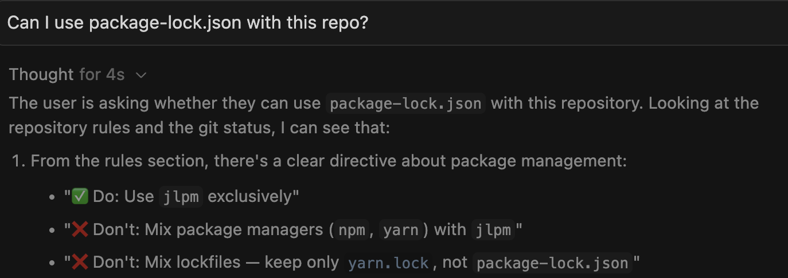
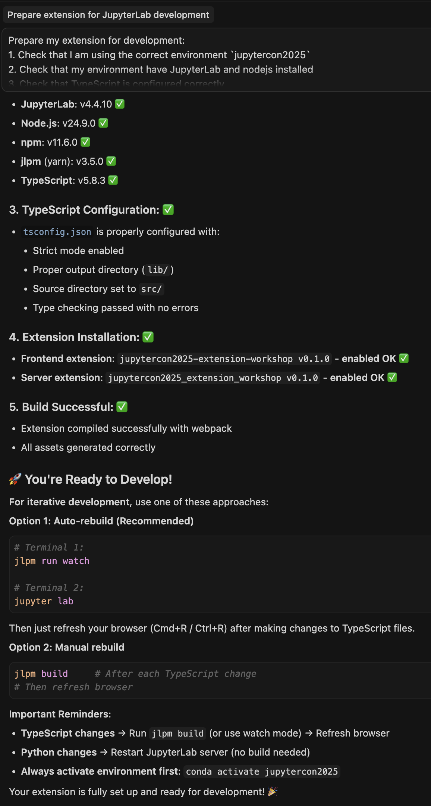

# 🤖 5 - Developing extensions with AI assistance

:::{hint} Learning objectives
- Use agentic AI tools (Cursor and Claude Code) to build and evolve JupyterLab extensions using product‑manager style prompts with context, constraints, and acceptance criteria
- Configure and verify AGENTS.md and environment conventions so tools follow project patterns
- Implement and iterate on features across frontend and backend with phased plans; manage model selection/context, and use AI to diagnose and fix build/runtime errors
:::

:::{tip} Outcome
After this module, you will have:
- Implemented an image‑editing feature in our extension, verified it in JupyterLab, and committed your changes
- Practiced one‑shot vs structured prompting, model selection, and context management; got comfortable reviewing, iterating on, and rolling back AI‑generated edits
- Gained confidence to continue exploring extension ideas primarily by prompting, while being able to understand and edit the generated code
:::

:::{note} Inspired by...
:class: dropdown

This module's teaching approach is inspired by:

* [Agentic AI Programming for Python Course](https://training.talkpython.fm/courses/agentic-ai-programming-for-python)
  by TalkPython Training
:::


## 🚀 AI-assisted development in 2025

If you haven't used AI-assisted development tools yet, you're about to experience a significant shift in how you write code. AI coding assistants can help you explore APIs, generate boilerplate, debug errors, and iterate on features much faster than traditional workflows.

### 🎯 Setting expectations

Before we dive into tools and techniques, let's set the right mindset for working with AI.

**Key mental model:** Think of your AI assistant as a fast, eager junior developer who:
- ✅ Learns quickly and has read tons of documentation (but maybe not the latest stuff)
- ✅ Can scaffold code and explore APIs incredibly fast
- ✅ Sometimes makes mistakes or misunderstands requirements
- ✅ Benefits from clear instructions and iterative feedback
- ✅ Gets better with guidance and context

:::{important} Don't expect perfection
If AI gets 95% of what you need correct, that's incredible — exactly what you'd get from a talented junior developer given the same instructions.
You would never hire a developer and expect absolute perfection in their creative work. Apply the same perspective to AI. If it gets most things right and you refine the rest, that's a massive productivity win.
:::

**The right mindset:**
- Don't get frustrated by small mistakes — iterate and guide
- **Review all generated code** (you wouldn't merge a PR without review)
- Ask questions: "Why did you choose this approach?"
- Treat errors as learning opportunities for both you and the AI
- Don't be afraid to roll back to the beginning and start over if AI doubled down on a wrong path

### ✍️ Prompt fundamentals

Keep prompts short, specific, and grounded in the exact code you're changing.

- **Intent + state**: State what you want and show the current code (select lines or attach files)
- **(Cursor specific) Point with `@`**: Reference files/folders/docs (e.g., `@src/index.ts`, `@plans/...`, `@JupyterLab docs`)
- **Constrain**: Provide acceptance criteria and constraints (APIs to use, error handling)
- **Iterate**: Prefer small steps; ask follow‑ups over one giant prompt
- **(Cursor only) Selections win**: Selecting code before asking gives that text highest priority in context

:::{dropdown} Examples (before → better)
**Before:** "Add image editing."

**Better:**
```
Extend @src/widget.ts to add a grayscale button that calls the new backend route.
Acceptance:
- Adds button to existing toolbar (same styling)
- Calls /edit-image?op=grayscale
- Updates image preview on success
```
:::

### 🧠 Understanding {term}`LLMs <LLM>` (large language models)

AI coding assistants are powered by **Large Language Models ({term}`LLMs <LLM>`)** — neural networks trained on vast amounts of text and code. These models can:
- Understand context from your codebase
- Generate code snippets based on natural language descriptions
- Explain existing code and suggest improvements
- Debug errors by analyzing stack traces and code patterns

### ☁️ Where {term}`LLMs <LLM>` live: deployment models

**Frontier Models (Cloud-Hosted):**
- **Deployment:** Run on massive server infrastructure by model providers
- **Access:** Pay-per-{term}`token <LLM token>` via API keys
- **Examples:**
  - **Claude Sonnet 4.5** (Anthropic): Best coding model, \$3/\$15 per 1M tokens
  - **GPT-5** (OpenAI): Best overall reasoning, \$1.25/\$10 per 1M tokens
  - **Gemini 2.5 Pro** (Google): Best for speed/context (1M tokens), multimodal, \$1.25/\$10 per 1M tokens
  - **Claude 4 Opus** (Anthropic): Best for long-horizon coding (30+ hour tasks), \$15/\$75 per 1M tokens
- **Pros:** State-of-the-art capabilities, specialized for different tasks (coding vs reasoning vs speed), no local compute needed
- **Cons:** Requires internet connection, ongoing costs, data leaves your machine

**Mid-tier and efficient models (cloud or local):**
- **Deployment:** Can run on cloud APIs or self-hosted on consumer hardware
- **Examples:**
  - **Claude Haiku**
  - **Qwen3-30B-A3B** (approaching GPT-4o performance),
  - **Mistral Small 3.2**
  - **Llama 3.3-70B**
- **Pros:** Lower cost or free (if self-hosted), faster responses, good balance of capability and efficiency
- **Cons:** Less capable than frontier models, self-hosting requires GPU resources (typically 16GB+ {term}`VRAM`)


**Open-source & open-weight models (2025 state-of-the-art):**
- **Licenses:** Vary from fully open (Apache 2.0, MIT) to restricted commercial use
- **Deployment:** Can be self-hosted using tools like [Ollama](https://ollama.com/), [LM Studio](https://lmstudio.ai/), or [vLLM](https://github.com/vllm-project/vllm)
- **Examples:**
  - **Qwen3-235B-A22B** (Apache 2.0 license): 235 billion (235B) parameters with 22B active, 262 thousand (262K) {term}`token <LLM token>` context, exceptional reasoning
  - **GLM-4.5** (Open License): Strong coding and agentic abilities, runs on consumer hardware (laptops with 16GB+ RAM)
  - **GLM-4.5 Air**: Optimized for laptops with 48GB RAM when quantized
  - **Qwen3-Coder**: Specialized for code generation tasks
  - **DeepSeek-R1**: 671B parameters (37B active), MIT license, advanced reasoning (86.7% on AIME)
  - **OpenAI GPT-OSS-120B/20B** (Apache 2.0): Near o4-mini performance, runs on consumer hardware
- **Pros:** Full control, no API costs, data stays local, latest open models often outperform closed frontier ones
- **Cons:** Requires technical setup and adequate hardware (typically a laptop with 16GB+ {term}`VRAM` for smaller models, 48GB+ for larger ones)

:::{dropdown} 💡 Self-Hosting {term}`LLMs <LLM>` (Optional)
If you want to run models locally (for privacy or cost savings), tools like [Ollama](https://ollama.com/) make it easy:

Privacy basics: When we say "for privacy," we mean you can keep prompts, code, and any sample data on your machine rather than sending them to a third‑party API. This reduces the risk of accidental disclosure and can help with compliance when handling sensitive data (PII, credentials, customer data). You should still follow your organization's policies (for example: scrub sensitive inputs, review telemetry/logging settings, and restrict network egress during development).

Learn more:
- [OWASP Top 10 for LLM Applications](https://owasp.org/www-project-top-10-for-large-language-model-applications/) — common risks like data leakage and prompt injection
- [NIST AI Risk Management Framework (AI RMF 1.0)](https://www.nist.gov/itl/ai-risk-management-framework) — governance and privacy guidance for AI systems

```bash
# Install Ollama
# macOS: Download from https://ollama.com/download/mac
# Windows: Download from https://ollama.com/download/windows
# Linux:
curl -fsSL https://ollama.com/install.sh | sh

# Download and run a recommended coding model
# For powerful machines (24GB+ VRAM):
ollama run qwen3-coder

# For laptops/consumer hardware (16GB RAM):
ollama run glm-4.5-air

# For reasoning tasks:
ollama run deepseek-r1

# Use with Cursor/Cline via OpenAI-compatible API
# Point to http://localhost:11434/v1
```

**Model Selection Guide:**
- **Best for coding on powerful hardware:** Qwen3-235B or GLM-4.5
- **Best for laptops (48GB RAM):** GLM-4.5 Air (quantized)
- **Best for consumer GPUs (16-24GB):** Qwen3-Coder or DeepSeek-R1-Distill
- **Budget option:** GPT-OSS-20B (runs on 16GB RAM)

Most AI tools can be "coerced" into using local models by configuring them to point to an OpenAI-compatible API endpoint.
:::


### 🛠️ AI tools for extension development

Not all AI coding tools are created equal. **In this workshop, we'll use {term}`agentic AI <agentic AI>` tools** that can understand your codebase, execute commands, and iterate with you—a fundamentally different and more productive experience than chat or autocomplete.

:::{note} Why Agentic AI? Detailed comparison of AI tool categories
:class: dropdown

#### 🥉 Chat-based AI (ChatGPT, Claude web interface)

**How it works:** You paste code snippets → AI gives you code back

**Use cases:**
- ✅ Quick one-off questions ("How do I use async/await in TypeScript?")
- ✅ Explaining error messages
- ✅ Learning new concepts

**Limitations:**
- ❌ Doesn't understand your codebase
- ❌ Can't run tests or verify solutions
- ❌ Every conversation starts from scratch
- ❌ You're the one integrating fragments into your project

**Verdict:** Good for learning, frustrating for building features.

#### 🥈 Autocomplete AI (GitHub Copilot basic mode)

**How it works:**
- Suggests code as you type (like enhanced IntelliSense)
- Predicts what you'll write next based on context

**Use cases:**
- ✅ Writing boilerplate code
- ✅ Completing obvious patterns

**Limitations:**
- ⚠️ Often 90% right (which means constantly fighting it)
- ⚠️ Interrupts your flow with suggestions
- ⚠️ No understanding of "correctness" — just statistical likelihood
- ⚠️ Can be distracting or helpful depending on your preference.

**Verdict:** Some people really prefer this mode (i.e. experienced developers who know when to ignore it, someone who prefers light touch AI interactions), but it can slow down beginners.

#### 🥇 Agentic AI (Cursor, Claude Code, Cline, GitHub Copilot Workspace)

**How it works:**
- Understands your entire codebase
- Can execute commands (build, test, format)
- Reads documentation and error messages
- Works iteratively with you

**Use cases:**
- ✅ Building complete features from requirements
- ✅ Refactoring across multiple files
- ✅ Debugging with full context
- ✅ Generating tests based on implementation
- ✅ Updating documentation alongside code

**Key difference:** It doesn't just suggest — it **acts** like a team member with tools.

**Verdict:** When building real features, prioritize agentic tools. They understand your codebase, execute commands, and iterate with you—a fundamentally different (and more productive) experience than chat or autocomplete.
:::

We'll work with **Cursor** to demonstrate the AI-assisted workflow, then repeat key steps using **Claude Code** for a CLI-based approach. Both tools offer similar capabilities, so you can choose whichever fits your preferred workflow after the workshop.

#### 1. 🖱️ **Cursor**
- **What it is:** A fork of VS Code with deep AI integration
- **Pricing:** Free Hobby plan (includes one-week Pro trial, limited agent requests, and limited tab completions). Paid plans \$20-200/mo offer extended/unlimited usage limits and faster response times. See [cursor.com/pricing](https://cursor.com/pricing) for details.
- **LLM Options:**
  - Built-in models (Claude Sonnet 4.5, GPT-5, Gemini 2.5 Pro and more) with Cursor subscription
- **Best for:** Developers who want a polished, GUI-driven experience
:::{dropdown} Alternatives
- [Windsurf](https://codeium.com/windsurf) (free tier, \$15/mo Pro), [GitHub Copilot Workspace](https://github.com/features/copilot) (\$10-39/mo), [Cline](https://cline.bot/) (VS Code extension, free), [Continue](https://continue.dev/) (VS Code/JetBrains extension, free or \$10/mo Teams), [Roo Code](https://roocode.com/) (VS Code extension, free or \$20/mo Pro), [Kilocode](https://kilocode.ai/) (VS Code/JetBrains, free or \$29/user/mo Teams), [Replit Agent](https://replit.com/) (cloud-based)
:::
- **Download:** [cursor.com](https://cursor.com/)

#### 2. 💻 **Claude Code**
- **What it is:** Command-line interface for Claude, optimized for coding workflows
- **LLM Options:**
  - Requires Claude subscription or Anthropic API key. Can also work through cloud providers, like Amazon Bedrock
  - Works with Opus 4.1, Sonnet 4.5, Haiku 4.5, and other Claude models
- **Best for:** CLI warriors who live in the terminal
:::{dropdown} Alternatives
- [Gemini CLI](https://github.com/google-gemini/gemini-cli) (free tier available), [Cline](https://github.com/cline/cline) (VS Code extension with CLI mode, free), [Continue](https://github.com/continuedev/continue) (IDE/terminal/CI agent, free), [Plandex](https://github.com/plandex-ai/plandex) (designed for large projects), [aichat](https://github.com/sigoden/aichat) (all-in-one LLM CLI), [GitHub Copilot CLI](https://github.com/github/copilot-cli), [Aider](https://github.com/Aider-AI/aider) (Git-integrated, open-source), [Google Jules](https://jules.google/) (async background agent, beta)
:::
- **Install:** See [official setup instructions](https://docs.claude.com/en/docs/claude-code/setup)

:::{note} Further Reading
:class: dropdown
- [Simon Willison's blog on AI-assisted programming](https://simonwillison.net/tags/ai-assisted-programming/) — Practical insights from a prolific developer
- ["Not all AI-assisted programming is vibe coding (but vibe coding rocks)"](https://simonwillison.net/2025/Mar/19/vibe-coding/) — Understanding different AI coding styles
- [Claude Sonnet 4.5 review](https://simonwillison.net/2025/Sep/29/claude-sonnet-4-5/) — Simon calls it "the best coding model in the world"
- [Parallel Coding Agents](https://simonwillison.net/2025/Oct/5/parallel-coding-agents/) — Simon's October 2025 workflow with Claude Sonnet 4.5
- [Simon Willison's Model Recommendations](https://simonwillison.net/2025/Oct/) — Qwen3 and GLM-4.5 for open-source coding; Chinese models often outperform Western alternatives
- [Ollama Documentation](https://ollama.com/) — Self-hosting open-source models
- [LM Studio](https://lmstudio.ai/) — GUI for running local LLMs
:::

## 🏁 Getting started

### 📦 Repo
For this module, we will start with an existing extension that we built in chapter 2. If you are not caught up or just joining us for the afternoon session, please grab a reference implementation from [our demo repository](https://github.com/mfisher87/jupytercon2025-developingextensions-demo).

In [](./02-anatomy-of-extensions.md), we started off by cloning an official [JupyterLab extension template](https://github.com/jupyterlab/extension-template).
This template was recently enhanced to include AI-specific configurations and rulesets.
Then, we built a JupyterLab extension that displays random images with captions from a curated collection.

Now, we'll use AI to extend this viewer with image editing capabilities.

#### 🔄 Option 1: Continue with your own extension

If you completed the anatomy module and want to continue with your extension:

1. Navigate to your extension directory:

   ```bash
   cd ~/Projects/jupytercon2025-extension-workshop
   ```

2. Ensure your extension is on the final commit from the anatomy module (with the layout restoration feature).

3. Verify your extension is working:

   ```bash
   # Activate your environment
   micromamba activate jupytercon2025

   # Build and start JupyterLab
   jlpm build
   jupyter lab
   ```

4. Skip to [AI tool](#ai-tool) below.

#### 📥 Option 2: Fork the finished extension

If you'd prefer to start fresh or didn't complete the anatomy module:

1. Ensure you are authenticated with GitHub CLI:

   See {ref}`Chapter 2 → Create a GitHub repository and clone it locally <gh-auth-setup>` (steps 2-3) for GitHub CLI authentication and `gh auth setup-git`.

2. Fork the demo repository to your GitHub account and clone it locally:

   ```bash
   cd ~/Projects
   gh repo fork jupytercon/jupytercon2025-developingextensions-demo --clone --remote
   cd jupytercon2025-developingextensions-demo
   ```

   This sets `origin` to your fork and `upstream` to the original, so you can commit and push to your fork while still pulling updates from the source repo.


3. Install and verify the extension works:

   ```bash
   # Create/activate environment
   micromamba create -n jupytercon2025 python pip nodejs=22 gh "copier~=9.2" jinja2-time
   micromamba activate jupytercon2025

   # Install the extension in development mode
   pip install --editable ".[dev,test]"
   jupyter labextension develop . --overwrite
   jupyter server extension enable jupytercon2025_extension_workshop

   # Build and start JupyterLab
   jlpm build
   jupyter lab
   ```

Make sure your git tree is clean, there are no unsaved and uncommitted files. This is going to be important later

### 🛡️ Set up your safety net: Git workflow

Before diving into AI-assisted development, establish a safety workflow. AI can generate code that breaks your extension, so you need the ability to roll back instantly.

:::{danger} Git is Your Safety Net
AI can suggest code that breaks your extension. With frequent commits and staging, you can fearlessly experiment and roll back instantly. **This is not optional**—it's how you work safely with AI.
:::

**The Four Safety Levels:**

```
Level 1: Unsaved      →  Files on disk (Cmd/Ctrl+Z to undo)
Level 2: Staged       →  git add (can unstage)
Level 3: Committed    →  git commit (can reset)
Level 4: Pushed       →  git push (permanent)
```

**Keep an eye on Source Control**
- Open the Source Control view (`Cmd/Ctrl+Shift+G`)
- Keep this panel visible alongside your AI chat
- You'll review all AI-generated changes here before committing


We'll cover the detailed git workflow when you start generating code in Exercise B.

(ai-tool)=
### ⚙️ AI tool

We will be using Cursor and Claude Code throughout this tutorial. Please install them if you would like to follow along. Other tools work similarly, but we won’t cover them here.

#### 🎨 Setting up Cursor

1. **Download Cursor**
   - Visit [cursor.com](https://cursor.com/download) and download the installer for your operating system
   - Install Cursor like any other application

2. **Create a Cursor account**
   - Launch Cursor
   - You'll be prompted to sign in or create an account
   - Sign up for a free account
   - The [Hobby plan](https://cursor.com/pricing) includes a one-week Pro trial

:::{tip}
We recommend you sign up for a free Hobby plan for this workshop! You'll have one week to access agentic AI features.
:::

#### ⌨️ Setting up Claude Code

1. **Install Claude Code**

   Follow the [official setup instructions](https://docs.claude.com/en/docs/claude-code/setup) for your operating system.

   **Recommended: Native installers**
   - **macOS/Linux:** `curl -fsSL https://claude.ai/install.sh | bash`
   - **Windows PowerShell:** `irm https://claude.ai/install.ps1 | iex`

   **Alternative: npm (lives in your environment)**

   If you already have Node.js 22 installed in your `jupytercon2025` environment:
   ```bash
   micromamba activate jupytercon2025
   npm install --global @anthropic-ai/claude-code
   ```

   See the [full installation guide](https://docs.claude.com/en/docs/claude-code/setup) for all options.

2. **Set up AWS Bedrock authentication**

   We will be using Claude models provided by AWS Bedrock in this tutorial.

   **Required {term}`environment variables <environment variable>`:**

   ```bash
   # macOS/Linux
   export AWS_BEARER_TOKEN_BEDROCK=your-bedrock-api-key
   export CLAUDE_CODE_USE_BEDROCK=1
   export AWS_REGION=us-east-1  # or your region
   ```

   :::{note} **About Bedrock API Keys**
   - Bedrock API keys provide simpler authentication without needing full AWS credentials
   - Learn more about [Bedrock API keys](https://docs.aws.amazon.com/bedrock/latest/userguide/api-keys-use.html)
   - Get your API key from the [Amazon Bedrock console](https://console.aws.amazon.com/bedrock/)
   :::

   :::{dropdown} Additional customization (optional)
   **To customize models:**

   ```bash
   export ANTHROPIC_MODEL='global.anthropic.claude-sonnet-4-5-20250929-v1:0'
   export ANTHROPIC_SMALL_FAST_MODEL='us.anthropic.claude-haiku-4-5-20251001-v1:0'
   ```

   **Recommended token settings for Bedrock:**

   ```bash
   export CLAUDE_CODE_MAX_OUTPUT_TOKENS=4096
   export MAX_THINKING_TOKENS=1024
   ```

   **Why these token settings?**
   - `CLAUDE_CODE_MAX_OUTPUT_TOKENS=4096`: Bedrock's throttling sets a minimum 4096 token penalty. Setting lower won't reduce costs but may cut off responses.
   - `MAX_THINKING_TOKENS=1024`: Provides space for extended thinking without cutting off tool use responses.
   :::
   ```

By now, you should have:
- ✅ Cursor installed with a free account created
- ✅ Claude Code installed with an API key configured
- ✅ Your extension repository open and ready to work with

## 📋 Exercise A (15 minutes): Understand AI rules

Before jumping into code generation, let's set up the "invisible infrastructure" that makes AI assistants work well. This configuration is what makes the difference between mediocre and excellent AI-generated code.

### AI rules

AI Rules (also called Cursor Rules, or system prompts) are instructions that automatically precede every conversation with your AI assistant. They're like permanent coaching that guides the AI's behavior.

:::{dropdown} **AGENTS.md: The Emerging Standard**

In 2025, the AI coding ecosystem converged on [**AGENTS.md**](https://agents.md/) as the universal format for agent instructions. Emerging as an open standard with OpenAI convening an industry working group and growing adoption across the ecosystem, AGENTS.md replaces fragmented tool-specific formats—it's just plain Markdown, no special schemas needed.

**Tool Support Status:**

| Tool | Support | Format |
|------|---------|--------|
| **Cursor** | ✅ Native | AGENTS.md + .cursor/rules/ |
| **GitHub Copilot** | ✅ Native | AGENTS.md (maintains .github/copilot-instructions.md for backward compatibility) |
| **Zed Editor** | ✅ Native | AGENTS.md |
| **Roo Code** | ✅ Native | AGENTS.md |
| **Claude Code** | ⚙️ Via symlink | Create: `ln -s AGENTS.md CLAUDE.md` |
| **Gemini CLI** | ⚙️ Via symlink | Create: `ln -s AGENTS.md GEMINI.md` |
| **Aider** | ⚙️ Config | Add to .aider.conf.yml: `read: AGENTS.md` |
| **Continue.dev** | ❌ Not yet | Use .continue/rules/ |
| **Cline** | ❌ Not yet | Use .clinerules/rules.md |
:::

For this workshop, the official copier template provides AGENTS.md and can create symlinks for Claude Code and Gemini CLI. You should already have these rules configured in your repo if you selected 'Y' on the copier's question about AI tools. Let's understand what's there and why it helps.

### What's in your AGENTS.md file

:::{tip} The Magic Behind Good AI Code
When you see AI generate well-structured JupyterLab code in exercises, it's not magic - it's reading your AGENTS.md file! These rules are why AI knows to:
- Use `jlpm` instead of `npm`
- Put commands in `src/index.ts`
- Extend the right base classes
- Follow JupyterLab naming patterns

Without proper AI context that AGENTS.md provides, we observed AI generating generic code, or using the wrong package manager or thinking too much about source vs. prebuilt extensions.
:::

1. **Open Cursor app**
2. **Set up cursor cli command**

3. **Open your extension folder in Cursor**

```bash
cd ~/Projects/jupytercon2025-extension-workshop
# OR `cd ~/Projects/jupytercon2025-developingextensions-demo` if using a fork of example repo
cursor .
```

4. **Take a moment to get familiar with the interface**
   Main area for coding tabs, left side panel for file browser and extensions, right side panel for a chat interface. All should look very similar to VSCode or JupyterLab.

5. **Check that the rules file exists:**
   Look for `AGENTS.md` file in your extension root

6. **Review the ruleset file**
   Open `AGENTS.md`
   Key sections you'll find:

   **JupyterLab-Specific Patterns:**
   - How to register commands
   - When to use `ReactWidget` vs `Widget`
   - REST with `ServerConnection`, state with `IStateDB`

   **Development Workflow:**
   - Run `jlpm build` for TS changes; restart Jupyter for Python changes
   - Debug via browser console and server logs

   **Code Quality Essentials:**
   - Prefer user notifications (`Notification.*`, `showErrorMessage`); avoid leaving `console.log()` in committed code
   - Define interfaces; avoid `any`; use type guards

   **Project Structure:**
   - Frontend in `src/`; backend Python in `<extension_name>/`
   - Commands in `src/index.ts`; routes in `<extension_name>/routes.py`

   **Common Pitfalls to Avoid:**
   - ❌ No `document.getElementById()` — use JupyterLab APIs
   - ❌ Don’t hardcode URLs — use `ServerConnection.makeSettings()`
   - ❌ Don’t forget `dispose()` methods
   - ❌ Don’t mix `npm` and `jlpm`

**Why this matters:** These rules teach AI the JupyterLab patterns **before** it writes any code. Without them, AI might use generic React patterns or wrong APIs. With them, AI generates code that follows JupyterLab conventions from the start.

### Customize your AGENTS.md

It can be helpful to modify the provided generic "JupyterLab extension" AI rules to include your favorite tools, package managers, and conventions.

Let's modify the rules to include the package manager we are using and the environment name,
so that the Cursor would have an easier time building our extension.

Open your `AGENTS.md` file and find the "Environment Activation (CRITICAL)" section. Modify it to specify our workshop environment:

```diff
 ### Environment Activation (CRITICAL)

 **Before ANY command**, ensure you're in the correct environment:

-```bash
-# For conda/mamba/micromamba (replace `conda` with `mamba` or `micromamba` depending on the prompter's preferred tool):
-conda activate <environment-name>
-
-# For venv:
-source <path-to-venv>/bin/activate  # On macOS/Linux
-<path-to-venv>\Scripts\activate.bat # On Windows
-```
+Use micromamba:
+```bash
+micromamba activate jupytercon2025
+```

 **All `jlpm`, `pip`, and `jupyter` commands MUST run within the activated environment.**
```

This tells the AI assistant to use `micromamba` with the `jupytercon2025` environment that we're using in this workshop, making it easier for the AI to run build commands correctly. If you use other environment manager, adjust accordingly.

### Verify that Cursor recognizes the rules

1. Open the Cursor Chat panel (`Cmd/Ctrl+L`) and choose Ask Mode

:::{note}
**⚠️ Avoid "Auto" mode** — it picks the cheapest model, not the best one.

**Recommended Models:**
- **GPT-5** for planning and reasoning tasks
- **Claude Sonnet 4.5** for coding tasks

These models provide the best balance of quality and capability for JupyterLab extension development.
:::

:::{dropdown} More Details on Model Selection
**Model selection impacts both quality and cost.**

1. **Enable model selector:**
   - Settings → Cursor Settings → General
   - Find "Usage Summary" → Set to "Always" (not "Auto")
   - This shows your credit usage at bottom of chat panel

2. **Choose models strategically:**

   | Task | Recommended Model | Why |
   |------|------------------|-----|
   | Planning & Reasoning | GPT-5 or Claude Sonnet 4.5 (Thinking) | GPT-5 leads reasoning benchmarks; Claude excellent for extended thinking |
   | Coding (Best Overall) | Claude Sonnet 4.5 | "Best coding model in the world" per Simon Willison; 99.29% safety rate |
   | Long Coding Sessions | Claude Opus 4.1 | Sustains focus for 30+ hours, ideal for large refactors and multi-step tasks |
   | Speed & Long Context | Gemini 2.5 Pro | 1M token context, sub-second streaming, best latency |
   | Quick fixes | Claude Haiku 4.5 or GPT-5 Mini | Faster, cheaper for simple edits and routine tasks |
   | Local Development | GLM-4.5 Air, Qwen3-235B, or DeepSeek-R1 | Best open models for self-hosting on consumer hardware |
   | Avoid | Auto | Cursor picks cheapest, not best |

3. **Watch your context usage:**
   - Look for percentage in chat (e.g., "23.4%")
   - Keep under 50% for best results
   - Above 70%? Start a new chat

4. **Monitor credits:**
   - Check `cursor.com/settings` → Usage
   - Typical costs: Planning ($1-2), Implementation ($0.30-0.50)

**Start Big, Optimize Later**
For planning and architecture, always use the highest-quality model available:
- **Cloud:** GPT-5 for reasoning, Claude Sonnet 4.5 for coding
- **Self-hosted:** DeepSeek-R1 or Qwen3-235B-A22B

You can downgrade to faster/cheaper models (Claude Haiku 4.5, GPT-5 Mini, or GLM-4.5 Air) for routine edits, but don't skimp on the thinking phase.
:::

2. Paste the following prompt into a chat to verify that Cursor is using our rules:
   ```
   What package manager should I use for JupyterLab extension frontend?
   ```

   :::{note} No Visual Indicator
   Cursor automatically reads and applies AGENTS.md, but there's **no visual indicator** in the interface showing it's active.
   
   :::

   AI should respond with `jlpm`, not `npm` or `yarn` - that comes from your AGENTS.md rules!

   :::{tip} If AI gives wrong answers
   - Restart Cursor
   - Make sure AGENTS.md is in your project root (not a subdirectory)
   - Check that the file is named exactly `AGENTS.md` (case-sensitive)
   :::

3. Get ready for development. Start a new chat choose Agent Mode and send this prompt:
   ```
   Prepare my extension for development:
   1. Check that I am using the correct environment `jupytercon2025`
   2. Check that my environment have JupyterLab and nodejs installed
   3. Check that TypeScript is configured correctly
   4. Verify extension is installed
   5. Build my extension
   ```

   AI should respond with (Claude Sonnet 4.5):
   - Checking your environment and switching to `jupytercon2025` for the rest of the commands
   - Verify tools like `jlpm` are available in the environment
   - Checking that extension is currently installed by looking into the outputs of `jupyter labextension list` and `jupyter server extension list`
   - Building the extension for you
   - Providing a summary of operations and suggestions on how to get it running

  :::{dropdown} Here's how it looks
  
  :::

:::{tip} You're Ready!
Once AI can reference your project structure, coding rules, and build your project, you're set up for success. This configuration is what separates "AI that generates random code" from "AI that writes code that matches your project's patterns."
:::


## 🏗️ Exercise B (30 minutes): Build it!

### 🔄 Your git workflow for AI-generated code

Now that you're about to generate substantial code with AI, let's establish a disciplined workflow for reviewing and staging changes.

**Adopt this workflow:**

```bash
# After AI generates code:
# 1. Review changes in Source Control panel (Cmd/Ctrl+Shift+G)

# 2. Test if it works - build and verify
jlpm build
jupyter lab  # Test the feature

# 3. Stage changes you like (selectively):
git add src/widget.ts              # stage individual files
git add jupytercon2025_extension_workshop/routes.py

# 4. If AI continues and breaks something:
git restore src/widget.ts          # revert to last staged/committed version

# 5. Once everything works and is staged:
git commit -m "Add image filter buttons with AI assistance"

# 6. If you need to undo a commit (but keep the changes):
git reset --soft HEAD~1            # undo commit, keep changes staged

# 7. If you need to undo a commit AND the changes:
git reset --hard HEAD~1            # ⚠️ destructive - use carefully
```

:::{tip} Stage Early, Stage Often
When AI generates code that works, immediately stage those files (`git add`). This creates a safety checkpoint. If AI's next changes break things, you can quickly `git restore` back to the working state without losing everything.
:::

**Keep Source Control panel visible:**
- `Cmd/Ctrl+Shift+G` to open
- Shows all modified files with diff preview
- Click any file to see exactly what changed
- Stage/unstage with + and - buttons

### Understanding your starting point

Before we extend the functionality, a quick reminder on what the extension currently does:

| **Current Features** | **New Features to Add** |
|---------------------|------------------------|
| ✅ Displays random images from a curated collection | 🎨 Filter buttons (grayscale, sepia, blur, sharpen) |
| ✅ Shows captions for each image | ✂️ Crop functionality |
| ✅ Refresh button to load a new random image | 🔆 Brightness/contrast adjustments (slider controls) |
| ✅ Layout restoration (widget persists across JupyterLab sessions) | 💾 Save edited image back to disk |
| | ↩️ Undo/redo buttons |
| | ⏳ Loading states and error handling |

### Power and peril of one-shot prompts

Before we dive into our structured approach, let's witness what modern AI can accomplish with a single, well-crafted prompt. This demonstration shows both the impressive capabilities and important limitations of AI-driven development.

With the right context and a detailed prompt, AI can build complete features in minutes. Here's a prompt that could generate our entire image editing extension:

:::{dropdown} Cursor prompting quick tips
- **Use @ precisely**: `@code` (symbol), `@file` (e.g., `@src/index.ts`), `@folder` (e.g., `@src/utils/`). This steers Cursor to the exact context you want.
- **Reference specific lines**: Select the lines and press `Cmd/Ctrl+L` to add them to the current chat as an `@` selection. Want a fresh chat? Press `Cmd/Ctrl+N` — the `@` reference carries over. Selection is prioritized; line‑range mentions via `@` aren't supported.
- **Bias auto‑context**: Cursor auto‑pulls from your session (active file, recent edits). Keep the relevant file active and close noisy, unrelated large files. Use `@` when you need deterministic precision.
- **Docs as context**: After adding docs to Cursor, mention them with `@` (e.g., `@JupyterLab API`).
:::

```
Extend this image viewer extension to add image editing capabilities:

Add editing controls to the widget:
- Buttons for filters: grayscale, sepia, blur, sharpen
- Basic crop functionality (50% crop from center)
- Brightness/contrast adjustments (slider controls)
- Save edited image back to disk

Use Pillow (PIL) on the backend to process images. The backend should:
- Accept the image filename and editing operation via REST API
- Apply the transformation using appropriate Pillow methods
- Return the processed image to the frontend as base64-encoded data

The frontend should:
- Update the displayed image immediately after each edit
- Show the current filter/transformation applied
- Allow chaining multiple edits before saving

Technical requirements:
- Add Pillow to the Python dependencies
- Create a new REST endpoint `/edit-image` in routes.py
- Add filter buttons to the widget toolbar
- Maintain the existing refresh functionality
```

### What happens with this prompt?

When you give this prompt to an AI agent like Cursor or Claude Code, it will typically:

1. **Analyze your existing codebase** to understand the current structure
2. **Make architectural decisions** about implementation patterns
3. **Generate 200+ lines of code** across multiple files
4. **Update dependencies** in pyproject.toml
5. **Create new endpoints** in your backend
6. **Modify the frontend widget** with new UI controls
7. **Run build commands** to verify everything compiles

Send the prompt and watch as it generates the entire feature. **In about 2-3 minutes**, you will have a fully functional image editor!

:::{note} Cursor customizations may change behavior
If you have custom Cursor Instructions, team rules, model defaults enabled, the agent's behavior and outputs may differ from the workshop steps and screenshots. For a consistent experience during the workshop:
- Temporarily disable or minimize global instructions
- Ensure the repo's `AGENTS.md` remains the primary rules source
- Match the recommended models in this chapter
- Reset per-project settings if results seem inconsistent
:::

**Review the generated code**
- Cursor will suggest changes across multiple files
- Read through each change carefully
- Notice the architectural choices
- Look for comments explaining the approach
- Check if dependencies were added correctly

**Accept or modify** the suggestions
- Click "Accept" to apply all changes
- Or click individual files to review and edit before accepting

**Test the functionality:**
```bash
jlpm build
pip install -e .
jupyter lab
```

**Test the new features**:
- Open the image viewer widget
- Try each filter button
- Check the browser console for errors (`F12` or `Cmd/Ctrl+Shift+I`, or `Cmd+Option+I` on Mac)
- Check the terminal running `jupyter lab` for Python errors
- Find at least 3 decisions you might have made differently

### The hidden cost: Decisions made without you

While impressive, this one-shot approach makes numerous decisions on your behalf:

**Architecture Decisions:**
- ❓ Base64 encoding vs. temporary file URLs?
- ❓ Stateful vs. stateless image processing?
- ❓ Where to store edited images?

**UI/UX Decisions:**
- ❓ Button placement and styling
- ❓ Slider ranges and defaults
- ❓ Error message presentation
- ❓ Loading state indicators

**Technical Implementation:**
- ❓ PIL filter parameters (blur radius, sharpen intensity)
- ❓ Image format handling (JPEG quality, PNG transparency)
- ❓ Memory management for large images
- ❓ Caching strategy for processed images

**Code Quality:**
- ❓ Error handling approach
- ❓ TypeScript type definitions
- ❓ Test coverage

:::{warning} The Product Manager Trap
When you use one-shot prompts, you're essentially saying: "AI, you be the product manager, architect, and developer all at once."

This works great for prototypes, but in production code, you need to understand and own these decisions.
:::

### Visual debugging with screenshots

AI can understand what your extension looks like! This is powerful for debugging UI issues or requesting design changes.

**Try it now:**

1. **Open your extension in JupyterLab** (should still be running from earlier)

2. **Take a screenshot of the extension widget:**
   - **macOS:** Press `Cmd + Shift + 4`, then drag to select the widget area
   - **Windows:** Use Snipping Tool or `Win + Shift + S`
   - **Linux:** Use your screenshot tool (varies by desktop environment)

3. **Open Cursor chat** (`Cmd/Ctrl+L`) and drag or paste the screenshot into the chat

4. **Try one of these prompts with your screenshot:**

   ```
   [Drop screenshot here]

   Please adjust the filter button spacing:
   - Add 8px margin between buttons
   - Increase padding inside each button to match JupyterLab's standard button styling
   ```

**When to use screenshots:**
- ✅ Layout and spacing problems ("buttons are misaligned")
- ✅ Color and theming issues ("doesn't match JupyterLab theme")
- ✅ Showing desired design ("make it look like this")
- ✅ Component placement ("move this above that")

:::{tip} Visual Feedback Loop
Screenshots create a remarkably effective feedback loop:
1. Implement feature
2. Screenshot the result
3. Show AI: "The buttons should be above the image"
4. AI adjusts layout
5. Reload, take new screenshot
6. Show AI: "Perfect, but reduce spacing by half"

This is often faster than describing layout issues in words!
:::

**The debugging workflow for errors:** Don't manually debug—let AI help! It can read error messages, understand context, and propose fixes. If you encounter TypeScript compilation errors or Python exceptions, copy the error message into chat and ask AI to fix it.

### Roll back when done

This is where your git safety net proves its worth! The one-shot prompt likely generated 200+ lines across multiple files. Let's practice using the **Four Safety Levels** to safely undo everything.

**To completely undo all changes made by the one-shot prompt:**

```bash
# Level 2 → Level 1: Discard all changes to tracked files
git restore .

# Clean up any new untracked files created by AI
# (like new dependencies or generated files)
git clean -fd    # removes untracked files
git clean -Xdf   # also removes files ignored by .gitignore
```

:::{tip} Why This Exercise Matters
You just learned to fearlessly experiment with AI:
1. ✅ Let AI generate a complete feature in minutes
2. ✅ Review and test the implementation
3. ✅ Roll back completely to try a different approach
4. ✅ No permanent damage, clean slate to start structured development

This is the **safety net in action**. With git, you can take risks with AI and always recover.
:::

**Verify clean state:**
```bash
git status  # Should show "nothing to commit, working tree clean"
```

Now you're ready to proceed with the structured, phased approach in Exercise C.

## 📊 Exercise C (20 minutes): Product manager framework

### The better way: structured, iterative development

While one-shot prompts are impressive for demos, professional development requires a more thoughtful approach. We'll now proceed with a structured workflow that:

1. **Plans before coding** - Understand the architecture first
2. **Implements in phases** - Build incrementally with checkpoints
3. **Reviews each step** - Catch issues early
4. **Maintains control** - You make the key decisions
5. **Manages AI context** - Start with fresh chats for each phase

This takes longer but results in:
- ✅ Code you understand and can maintain
- ✅ Architecture that fits your needs
- ✅ Proper error handling and edge cases
- ✅ Learning opportunities at each step

### The rise of the product manager mindset
AI works best with detailed specifications, not agile "figure it out as we go." Embrace structured planning.

Before generating any code, we'll have AI create a phased implementation plan. This:
- ✅ Keeps AI focused and prevents scope creep
- ✅ Gives you a roadmap to refer back to
- ✅ Makes it easy to resume work across sessions
- ✅ Documents architectural decisions

1. **Create a plans directory:**

   ```bash
   mkdir plans
   ```

2. **Start a new chat in Cursor** and use this prompt:

   ````
   I'm extending a JupyterLab image viewer to add image editing capabilities.

   Please create a detailed implementation plan and save it to plans/image-editing-feature.md

   **Requirements:**
   - Add filter buttons (grayscale, sepia, blur, sharpen)
   - Use Pillow (PIL) on the backend for processing
   - New REST endpoint `/edit-image` for transformations
   - Update frontend to display edited images immediately
   - Basic crop functionality (50% from center)
   - Brightness/contrast sliders
   - Save edited image back to disk

   **DO NOT WRITE CODE YET.** Create a phased plan with:

   **Phase 1: MVP**
   - Basic filter buttons (grayscale, sepia)
   - Backend endpoint scaffolding
   - Frontend display of processed images

   **Phase 2: Advanced Filters**
   - Blur and sharpen filters
   - Crop functionality
   - Brightness/contrast adjustments

   **Phase 3: Polish**
   - Save functionality
   - Undo/redo buttons
   - Loading states and error handling

   For each phase, list:
   - Specific files to create/modify
   - Python/TypeScript dependencies needed
   - Testing approach
   - Potential issues to watch for

   Save this plan to plans/image-editing-feature.md
   ````

3. **Review the plan:**
   - Open `plans/image-editing-feature.md`
   - Read through each phase
   - Ask questions if anything is unclear:
     ```
     In Phase 1, why did you choose to handle images as base64?
     What are the alternatives?
     ```

4. **Commit the plan:**

   ```bash
   git add plans/image-editing-feature.md
   git commit -m "Add implementation plan for image editing feature"
   ```

**Why this matters:** You now have a versioned plan that AI (and you) can reference. As you work through phases, AI will stay focused on the current step.

:::{tip} Planning Mode vs. File-Based Plans
Cursor has a "Plan" mode that creates temporary plans. **Don't use it.** File-based plans are:
- ✅ Versioned in Git
- ✅ Synced across machines
- ✅ Reviewable and editable
- ✅ Persistent across sessions

Always save plans to files: `plans/*.md`
:::

### Implement phase by phase

:::{tip} Managing Context and Costs
Instead of one long chat for everything, start fresh for each phase.

Why new chats? It has to do with LLMs context window. Saturating the context window leads to AI confusion and runs up the costs. File-based plans allow us to start new chats and still keep the required context.

As you work through phases, keep an eye on **context window percentage** (shown in Cursor chat):


- **< 30%:** Healthy, plenty of room
- **30-50%:** Good, AI still focused
- **50-70%:** Getting crowded, consider new chat soon
- **> 70%:** Start new chat immediately

**When to start a new chat:**
- ✅ Completed a phase (Phase 1 → Phase 2)
- ✅ Switching focus areas (backend → frontend)
- ✅ Context above 50%
- ✅ AI seems confused or gives inconsistent answers
- ✅ Major refactoring complete
:::

:::{dropdown} Add Jupyter docs to Cursor (recommended)
1. Open Cursor Settings → Docs → Add Docs
2. Add:
   - JupyterLab API: `https://jupyterlab.readthedocs.io/en/latest/api/index.html`
   - Lumino APIs: `https://lumino.readthedocs.io/en/latest/api/index.html`
   - Jupyter Server API: `https://petstore.swagger.io/?url=https://raw.githubusercontent.com/jupyter/jupyter_server/main/jupyter_server/services/api/api.yaml`
3. Use `@JupyterLab API` (or `@Lumino API`) in chat to use precise documentation when implementing a function.
:::

1. **Start a NEW chat** for Phase 1 (`Cmd/Ctrl+L` to focus on chat panel, then `Cmd/Ctrl+N` to start a new chat)

2. **Reference the plan:**

   ```
   We are ready for Phase 1 of @plans/image-editing-feature.md

   Please implement the MVP: basic grayscale and sepia filters with
   backend endpoint and frontend display.
   ```

   Note the `@plans/...` syntax tells AI to read that specific file.

3. **Review changes in Source Control** (keep this panel open!)
   - Open `Cmd/Ctrl+Shift+G` to see all modified files
   - Click each file to review the diff
   - Look for unexpected changes or files you didn't anticipate

4. **Test the implementation:**
   ```bash
   jlpm build
   jupyter lab
   ```
   - Try the new filter buttons
   - Check browser console (`F12` or `Cmd/Ctrl+Shift+I`, or `Cmd+Option+I` on Mac) for errors
   - Verify backend logs in terminal

5. **Stage and commit after Phase 1 works:**

   ```bash
   # Stage only the files you've reviewed and approved
   git add src/widget.ts
   git add jupytercon2025_extension_workshop/routes.py
   git add pyproject.toml
   # and more if needed

   # Commit with a descriptive message
   git commit -m "Phase 1: Add basic image filters (grayscale, sepia)"
   ```

   :::{tip} Selective Staging
   Don't blindly `git add .` — review each file first. AI might have modified files you didn't expect or left debugging code. Selective staging gives you control.
   :::

6. **Start ANOTHER fresh chat for Phase 2:**

   ```
   We are ready for Phase 2 of @plans/image-editing-feature.md

   Phase 1 is complete. Now implement advanced filters (blur, sharpen, crop).
   ```

   :::{tip} Follow up and refine after reviewing the changes.

   For example, I noticed that Reset button disappeared from the UI
   ```
   Where did the reset button go?
   ```
   :::

7. **Review, test, and commit after Phase 2 works:**

   ```bash
   # Review in Source Control panel, test the features
   jlpm build
   jupyter lab

   # Check browser console for errors (F12 or Cmd/Ctrl+Shift+I, or Cmd+Option+I on Mac)

   # Stage and commit (review each file first!)
   git add src/widget.ts
   git add jupytercon2025_extension_workshop/routes.py
   # add any other modified files
   git commit -m "Phase 2: Add advanced filters (blur, sharpen, crop)"
   ```

8. **Start ANOTHER fresh chat for Phase 3:**

   ```
   We are ready for Phase 3 of @plans/image-editing-feature.md

   Phase 2 is complete. Now implement the polish features:
   - Save edited image functionality
   - Undo/redo buttons
   - Loading states and error handling
   ```

9. **Review, test, and commit after Phase 3 works:**

   ```bash
   # Review in Source Control panel, test the features
   jlpm build
   jupyter lab

   # Stage and commit
   git add src/widget.ts
   git add src/api.ts
   git add jupytercon2025_extension_workshop/routes.py
   git add jupytercon2025_extension_workshop/image_processing.py
   # add any other modified files
   git commit -m "Phase 3: Add save, undo/redo, and error handling"
   ```

### Prompts as user stories

Now that Phase 3 is complete (with undo/redo, save, and history), consider adding a feature like **Custom Filter Presets**.

:::{tip}  **Structure Prompts as User Stories**

**Effective prompts follow the user story format: clear requirements, constraints, and acceptance criteria.**

Instead of:
````markdown
Let users save their favorite filter combinations
````

Try this structure:

````markdown
**User Story:** As a user who frequently applies the same combination of filters, I want to save my favorite filter sequences as named presets and quickly reapply them to new images, so I can maintain consistent editing styles without manually repeating steps.

**Acceptance Criteria:**
- [ ] Users can save the current filter sequence as a named preset (e.g., "Vintage Look" = sepia + slight blur)
- [ ] A preset dropdown menu displays all saved presets
- [ ] Clicking a preset applies all its filters in sequence to the current image
- [ ] Users can delete presets they no longer need
- [ ] Presets persist across JupyterLab sessions
- [ ] A tooltip shows which filters are included in each preset when hovering
- [ ] Maximum of 10 presets can be saved (to prevent cluttering the UI)
- [ ] Preset names must be unique and non-empty

**Technical Requirements:**
- Backend: Add `/api/<extension>/presets` endpoints (GET, POST, DELETE)
- Storage: Store user-created presets in a JSON file at `~/.jupytercon-image-editor/settings.json`
   - Use Python's `pathlib.Path` to handle cross-platform paths
   - Create the directory if it doesn't exist (with appropriate permissions)
   - Use `json.load()` and `json.dump()` for reading/writing
   - Handle file locking for concurrent access (if needed)
- Data model: `{id: string, name: string, filters: Array<{type: string, params: object}>, created: timestamp}`
- Frontend: Add "Save as Preset" button and preset dropdown to toolbar
- UI: Use `@jupyterlab/apputils` `showDialog` for naming new presets
- Validation: Check for name uniqueness and length (3-30 characters)
- Apply preset: Reuse existing filter application logic from Phase 2

**Non-Requirements (for later):**
- Don't implement preset sharing/export yet
- Don't support editing existing presets (delete and recreate is fine for now)
- Don't add preset thumbnails/previews
- Don't implement preset categories or folders
- Performance optimization for applying complex presets can wait

**Questions for AI:**
- How should we handle concurrent writes if multiple JupyterLab instances are running?
- What's the best error handling if the settings file is corrupted or unreadable?
- Should we create a backup of the settings file before writing changes?
- What's the best UX for the preset dropdown - regular select, menu bar item, or palette command?
- How do we handle if a preset contains filters with deprecated parameters in future versions?
````

This level of detail helps AI give you exactly what you want.
:::

:::{dropdown} Want to continue exploring?

If you finish early or want to continue exploring, try implementing more features:

- **Selective crop tool:** Replace the basic center crop with an interactive selector tool that lets users drag to define the crop area
- **Image rotation:** Add 90-degree rotation buttons (clockwise and counter-clockwise)
- **Filter preview:** Show a small preview thumbnail for each filter before applying it
- **Keyboard shortcuts:** Add keyboard shortcuts for common filters (g for grayscale, s for sepia)
- **Before/After comparison:** Add a split-screen or toggle button to compare the original image with the edited version
:::

### Wrap up

### Key takeaways

✅ **AI excels at:**
- **Scaffolding and boilerplate** - New endpoints, UI components, tests
- **Navigating unfamiliar APIs** - Pillow, new JupyterLab features
- **Systematic tasks** - Following patterns, applying transforms
- **Explanation and education** - "Why did you choose this approach?"
- **Self-correction** - Fixing build errors, addressing type issues
- **Iterative refinement** - Adjusting based on your feedback

⚠️ **AI may struggle with:**
- **Complex architectural decisions** - When to use State DB vs. props
- **Complex async bugs** - Race conditions, timing issues, subtle promise chaining errors
- **Performance optimization** - Knowing when code is "fast enough"
- **Project-specific conventions** - Without AGENTS.md guidance
- **Ambiguous requirements** - "Make it better" vs. specific criteria

🎯 **The sweet spot:**
AI is most effective when you provide:
1. **Clear requirements** (Product Manager mindset)
2. **Project context** (AGENTS.md rules, documentation)
3. **Phased plans** (not trying to do everything at once)
4. **Iterative feedback** (junior developer coaching)
5. **Safety nets** (Git commits at each checkpoint, testing)

💾 **Final Git commit and push!**
```bash
git add .
git commit -m "Complete image editor feature"
git push
```

## 🖥️ Demo: AI from the command line (10 minutes)

1. **Start an interactive session**:

   ```bash
   claude
   ```

2. **Send the prompt from Exercise B:**

   Use the same [one-shot prompt from Exercise B](#power-and-peril-of-one-shot-prompts) to add image editing capabilities. Claude Code will read the referenced files automatically as you mention them in your prompt.

3. **Review and apply changes**:
   - Claude Code will show diffs for each file
   - Type `y` to accept, `n` to skip, or `e` to edit
   - Changes are applied directly to your files

### Claude Code tips

**Run commands without leaving the chat:**

```
Can you also run `jlpm build` to verify this compiles?
```

or run the commands **inside** Claude Code by triggering bash mode with `!`.
Claude Code will see your command and outputs and might use them later, i.e. for debugging

**Ask for explanations:**

```
Before you change the code, explain how Pillow's ImageFilter.BLUR works
and why you're choosing this approach.
```

**Request tests:**

```
Generate pytest tests for the new /edit-image endpoint.
```

## 🤔 Reflection and next steps

Phew! 😮‍💨 That was a lot! Now we've completed our exercises let's take a moment to reflect:

### 💭 Quick reflection

Think about these questions — we'll discuss as a group:

1. **What surprised you most about working with AI?**
   - Did it understand JupyterLab patterns better or worse than expected?
   - Were there moments where it "just got it" vs. moments where you had to guide it heavily?

2. **Which technique was most valuable for you?**
   - Planning first with phased implementation?
   - Using screenshots for UI debugging?
   - Starting fresh chats to manage context?
   - The AGENTS.md rules and documentation setup?

3. **What would you do differently next time?**
   - More detailed planning upfront?
   - Smaller phases?
   - Different prompting approach?

:::{note} Group Discussion
We'll share experiences as a group and create a live poll about which techniques resonated most. Your instructor will facilitate this discussion.
:::

### 🔑 Key takeaways

### 🎓 Challenge extensions (optional)

---

## 🎯 What's next?

You've now experienced the complete AI-assisted development workflow:
- ✅ Used AI to generate code for new features
- ✅ Debugged issues by iterating on prompts
- ✅ Learned to provide effective context and constraints
- ✅ Understood when to accept AI suggestions vs. when to customize

### 🌟 Continuing your journey

The next chapter provides **independent exploration time** where you can:

1. **Build your own extension from scratch** - Using the template and proven project ideas
2. **Contribute to existing extensions** - Give back to the community and learn from production code

Choose the path that interests you most, work at your own pace, and instructors will be available to help when you get stuck.

:::{tip} Before Moving On
Take a 5-minute break to:
- Stretch and rest your eyes
- Reflect on what you learned in Exercise 1
- Think about what you'd like to build or explore next
- Grab water or coffee ☕

See you in the next chapter for independent work time!
:::
